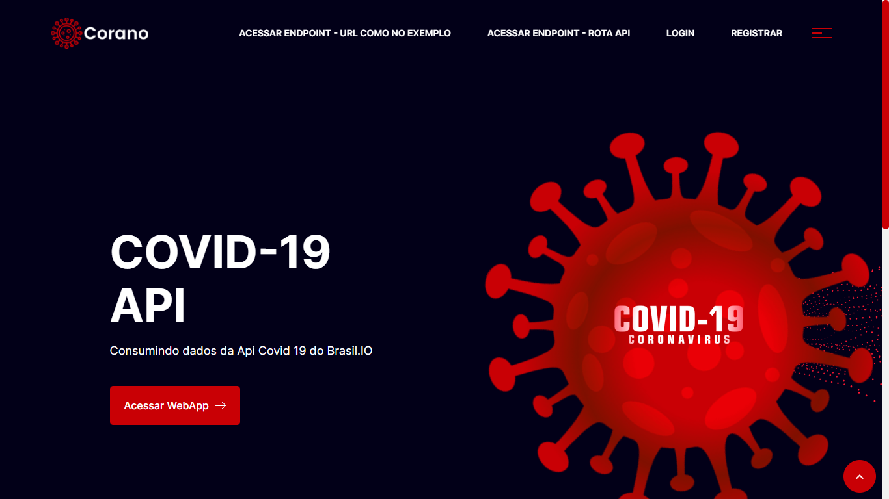
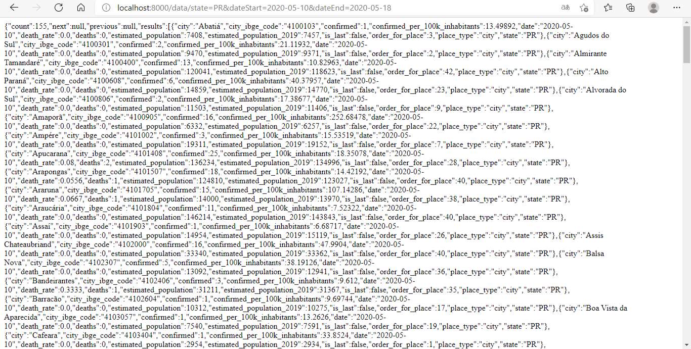
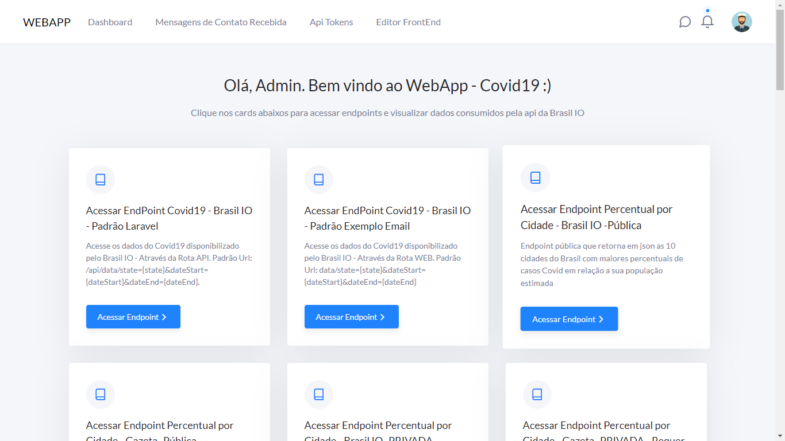
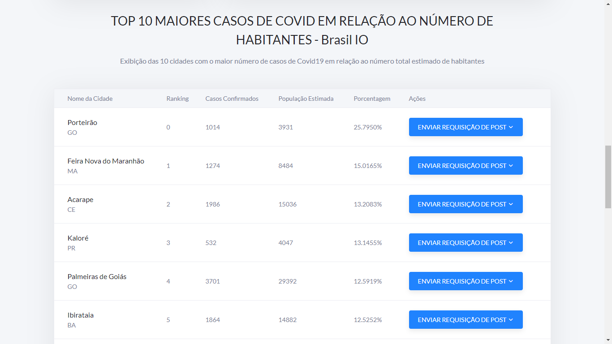
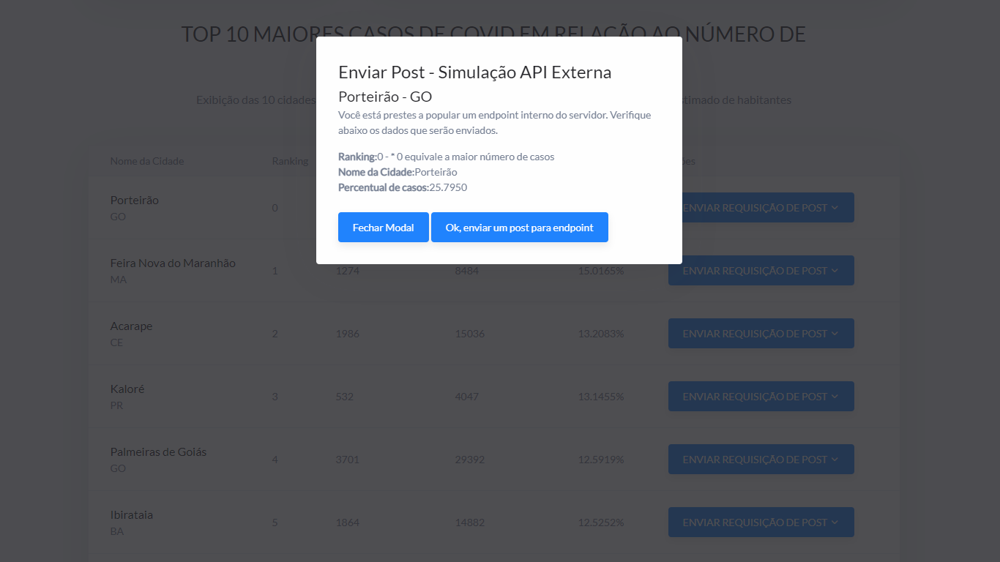
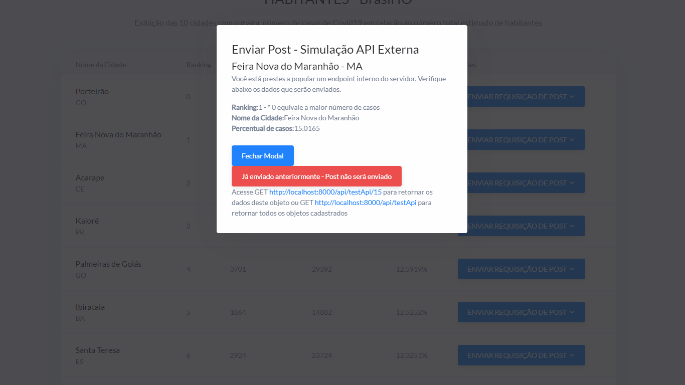
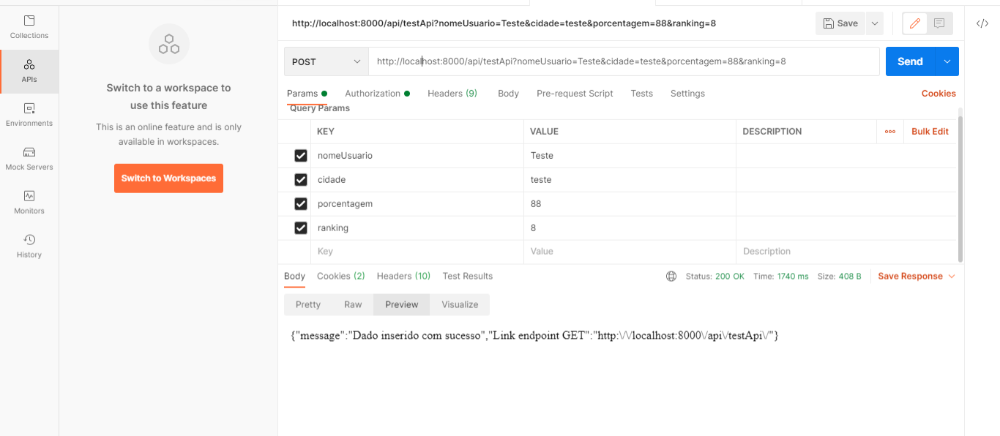
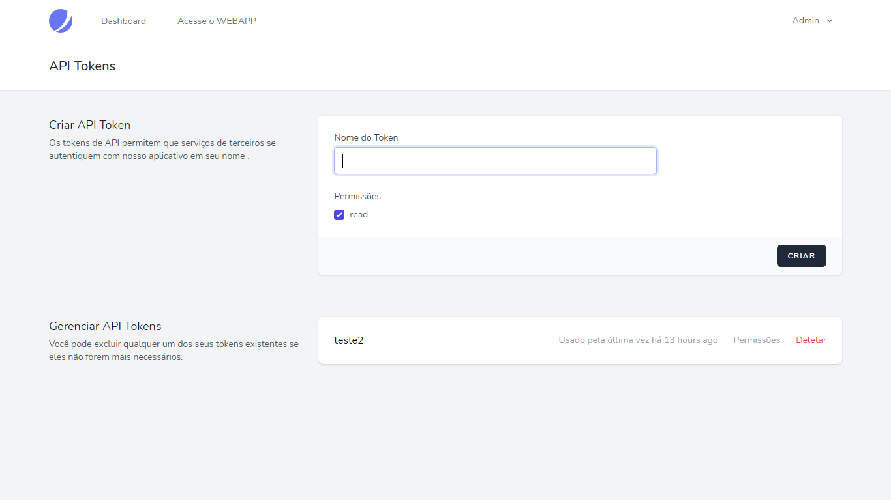
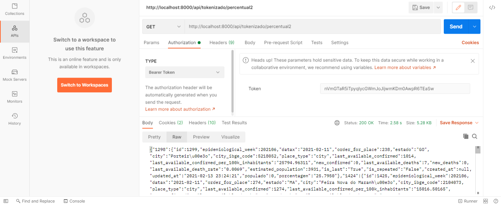

## Laravel - Protótipo Covid Api - Teste Processo Seletivo - Vaga Remota - Laravel 

Protótipo simples de uma aplicação em Laravel que retorna em url interna os dados sobre o Covid19 , consumindo a api do Brasil IO.
Pilha Laravel + JeatStream Liveware + Guzzle + Voyager Laravel.
Este repositório é o resultado final de uma prova prática entregue aos avaliadores, para concorrer a uma vaga de desenvolvedor Laravel.

  

- [Veja a Demonstração](https://dev3.algoritmo9.site).
- login: admin@admin.com
- senha: admin999

## Instalação

 - Clone para o seu servidor
 - Insira suas credenciais no arquivo .env
 - Importe o arquivo projeto01.sql para a sua base de dados recém criada. Não utilize Migrate
 - Certifique-se que possui acesso para escrita na pasta /storage
 - Tenha o node a partir da v12 instalado
 - Rode sudo npm install e sudo npm run dev para que o frontend seja compilado
 - Em alguns casos pode ser necessário regenerar o link storage na pasta pública. Delete a pasta /storage localizado em /public e rode o comando: php artisan storage:link

## Templates Frontend Utilizados

Para essa aplicação os seguintes templates html puro foram utlizados:
 - Corano Html Template (https://elements.envato.com/pt-br/corano-covid-19-coronavirus-awareness-html-CFYLCSL)
 - Neat Dashboard (https://elements.envato.com/pt-br/neat-web-application-kit-dashboard-template-5KC6GE)

Todo o backend da aplicação implementado no Laravel por mim está disponível sob a licença MIT, os templates html utilizados para o frontend desta aplicação possuem termos de licenças próprias que você pode verificar aqui em (https://elements.envato.com/pt-br/license-terms).

### Endpoints

- *GET: /api/data/state={state}&dateStart={dateStart}&dateEnd={dateEnd} -* - Retorna os dados do Covid19 disponibilizado pelo Brasil IO, através da Rota API, seguindo a padronização de url das apis em Laravel
- *GET: /data/state={state}&dateStart={dateStart}&dateEnd={dateEnd} -* - Retorna os dados do Covid19 disponibilizado pelo Brasil IO, através da Rota Web, seguindo o modelo de exemplo enviado no email.
- *GET: /percentual2 -* - Endpoint pública que retorna em json as 10 cidades do Brasil com maiores percentuais de casos Covid em relação a sua população estimada, segundo os dados da Brasil IO
- *GET: /percentual -* Endpoint pública que retorna em json as 10 cidades do Brasil com maiores percentuais de casos Covid em relação a sua população estimada. Alguns dados importantes do Brasil IO estavam nulos e aparentemente não muito consistentes. Em alternativa foi utilizado os dados da Gazeta para fins de comparação 
- *GET: /api/tokenizado/percentual2 -* Endpoint **privado** que retorna em json as 10 cidades do Brasil com maiores percentuais de casos Covid em relação a sua população estimada, segundo os dados do Brasil IO. Este endpoint requer token de autorização que pode ser criado na área de Apis Tokens, dentro da aplicação. Para testar a endpoint é recomendado o uso da ferramenta Postman, insira no header da requisição GET o Bearer Token criado.
- *GET: /api/tokenizado/percentual -* Endpoint **privado** que retorna em json as 10 cidades do Brasil com maiores percentuais de casos Covid em relação a sua população estimada, segundo os dados da Gazeta. Este endpoint requer token de autorização que pode ser criado na área de Apis Tokens, dentro da aplicação. Para testar a endpoint é recomendado o uso da ferramenta Postman, insira no header da requisição GET o Bearer Token criado.
- *POST: /api/TestApi -* Endpoint pública que permite o envio de requisição Post, através do endpoint. Parametros Aceitos:nomeUsuario,cidade,porcentagem,ranking
- *GET: /api/testApi -* Endpoint que retorna todos os objetos criados através da rota Post acima.
- *GET: /api/testApi/$id -* - Retorna um objeto através do id como parametro.

## Outras Funcionalidades

Para exibição dos contadores de casos disponiveis na página inicial, foi criado um webcrawler que raspa os dados do site: https://www.worldometers.info/coronavirus/ , através do pacote Laravel goutte. Até o momento esta funcionalidade ainda não foi habilitada na versão em produção, devido a algumas configurações do servidor que precisam ser realizadas mas localmente irá rodar tranquilamente.
Você pode verificar o código em : /app/Http/Controllers/Crawller.php

## Algumas capturas de tela

  

  

  

  

  

  

  

  

  

## 2021

